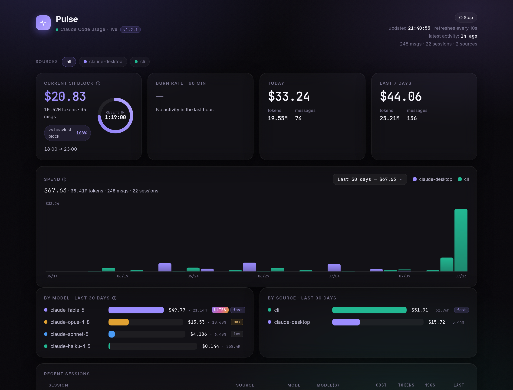
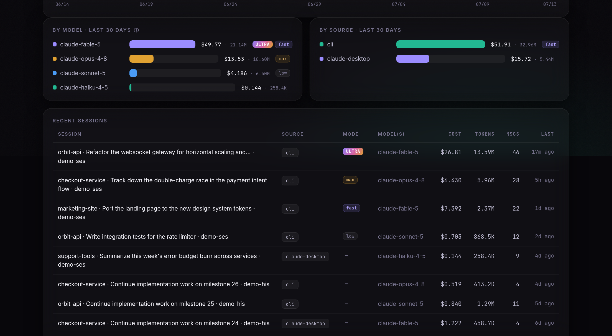
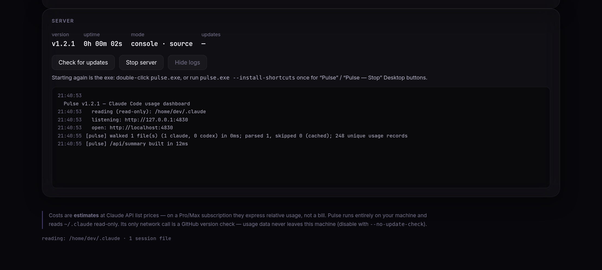

<div align="center">
  

# Pulse

**A live, local, zero-dependency usage dashboard for [Claude Code](https://claude.com/claude-code).**

See what you're spending, which models you're burning it on, your 5-hour block, and
which sessions ran at which reasoning effort — all from the logs already on your machine.

[](https://github.com/ReFxFrank/Pulse-Usage-Monitor/releases/latest)
[](https://github.com/ReFxFrank/Pulse-Usage-Monitor/releases)
[](LICENSE)
[](https://github.com/ReFxFrank/Pulse-Usage-Monitor/releases/latest)
[](package.json)

  
</div>

---

## ✨ Features

- 💸 **Live spend tracking** — current 5-hour block with reset countdown, burn rate,
  today / last 7 days, and a 30-day stacked spend chart. Refreshes every 10 seconds.
- 📅 **Any period** — rolling 30 days or any past calendar month from the dropdown.
- 🤖 **Per-model & per-source breakdowns** — cost, tokens, and messages for every model
  and entry point (CLI, desktop app), with stable colors.
- 🟢 **OpenAI Codex support** — if you also use the [Codex CLI](https://github.com/openai/codex),
  Pulse ingests `~/.codex/sessions` automatically: `gpt-*` model rows, a `codex`
  source, session titles, reasoning-effort chips, and costs at OpenAI list prices.
- 📡 **Official account meters** — provider-issued gauges with **true reset
  times**: Anthropic's account-wide 5-hour/weekly bars (opt-in; includes
  claude.ai chats, cloud sessions, other devices) and your ChatGPT plan's
  **Codex session/weekly allowance** (automatic — read from snapshots Codex
  already writes to its local logs).
- 🧠 **Reasoning-effort chips** — see which sessions ran at `low → max`, ultracode, or
  fast mode. Works **out of the box, retroactively**: Pulse reads your `/effort`
  commands straight from the session transcripts.
- 🗂 **Recent sessions table** — titles, models, mode, cost, tokens, and recency.
- 🖥 **No console window** — on Windows the exe runs hidden in the background; logs,
  version, uptime, **Stop**, and updates live in the dashboard's **Server panel**.
- 🔄 **Self-updating** — one click installs new releases (sha256-verified against the
  GitHub API). Double-clicking a newer exe over a running old one takes over cleanly.
- ⏯ **Easy start/stop** — Stop button in the header; `--install-shortcuts` puts
  **"Pulse"** / **"Pulse — Stop"** buttons on your Desktop; `--stop` for scripts.
- 🪶 **Zero runtime dependencies** — one Node process, built-ins only (`npm ls` is empty).
- 🔒 **Local-first** — binds to `127.0.0.1`, reads `~/.claude` strictly read-only, and
  makes **no network calls** except an optional GitHub version check.

<div align="center">
  
</div>

## 🚀 Quick start

### Download (easiest — no Node required)

Grab the latest single-file executable from
**[Releases](https://github.com/ReFxFrank/Pulse-Usage-Monitor/releases/latest)**:

| Platform | Get running |
| --- | --- |
| **Windows** | Download `pulse.exe`, put it in a permanent folder, double-click. Pulse starts in the background and opens `http://localhost:4747`. SmartScreen may warn (unsigned binary): **More info → Run anyway**. |
| **Linux** | `chmod +x pulse-linux && ./pulse-linux` |
| **macOS** (Apple Silicon) | `chmod +x pulse-macos && xattr -d com.apple.quarantine pulse-macos; ./pulse-macos` (the `xattr` clears Gatekeeper's quarantine on the unsigned binary) |

Paths are resolved per-user at runtime — `~/.claude` (or `CLAUDE_CONFIG_DIR` if
Claude Code was relocated) and `~/.codex` (or `CODEX_HOME`) of whoever runs it.
Nothing to configure.

Then, optionally, on Windows:

```bat
pulse.exe --install-shortcuts
```

adds **"Pulse"** (start / open dashboard) and **"Pulse — Stop"** buttons to your Desktop.
Starting is idempotent — if Pulse is already running, double-clicking just opens the dashboard.

### Run from source

Node ≥ 18, zero runtime dependencies; the pre-built frontend is committed:

```sh
git clone https://github.com/ReFxFrank/Pulse-Usage-Monitor && cd Pulse-Usage-Monitor
node server.js          # → http://localhost:4747
```

To hack on the React frontend (`web/`): `npm run build` (Node ≥ 20) rebuilds it,
`npm run dev` runs Vite with hot reload, `node build/make-exe.mjs` packages a
single-file executable for your OS.

### Deploy on an Ubuntu VPS (one command)

```sh
curl -fsSL https://raw.githubusercontent.com/refxfrank/Pulse-Usage-Monitor/main/install.sh | bash
```

Installs Pulse as a systemd service bound to `127.0.0.1` (auto-restart, start on
boot). Reach it over an SSH tunnel — the dashboard exposes usage metadata, so it
is deliberately **not** internet-facing:

```sh
ssh -N -L 4747:localhost:4747 <you>@<your-vps-ip>
```

Manage with `sudo systemctl status|restart pulse`, logs via `journalctl -u pulse -f`.
Overrides: `PULSE_PORT`, `PULSE_HOST`, `PULSE_DIR`, `PULSE_BRANCH`, `CLAUDE_DIR`.
Re-running the installer updates and restarts the service.

## 🎛 Options

| Flag / env         | Effect                                                        |
| ------------------ | ------------------------------------------------------------- |
| `--port N` / `PORT`| Listen port (default `4747`).                                 |
| `--host H` / `HOST`| Bind address (default `127.0.0.1`). `0.0.0.0` exposes it on the network — see the warning it prints; prefer an SSH tunnel. |
| `--stop`           | Stop the running Pulse instance and exit.                     |
| `--install-shortcuts` | (Windows) add **"Pulse"** and **"Pulse — Stop"** Desktop shortcuts. |
| `--no-daemon`      | (Windows exe) stay in the console window instead of backgrounding. |
| `--no-update-check`| Disable the GitHub version check — Pulse then makes zero network calls. Also: `PULSE_NO_UPDATE_CHECK=1`, or `{"updateCheck": false}` in `~/.pulse/config.json`. |
| `--no-open`        | Don't auto-open the browser (packaged exe).                   |
| `--effort-setup`   | Print the optional effort-logging hooks snippet.              |
| `--version` / `--help` | The usual.                                               |
| `--inspect-schema` | Print the record schema observed in your logs, then exit.     |
| `CLAUDE_DIR`       | Override the `~/.claude` location for non-standard installs.  |

## 🖥 The Server panel

Everything you'd normally need a console for lives at the bottom of the dashboard:
version, uptime, mode, live server logs, **Stop**, **Check for updates**, and
one-click **Update now** (downloads the release asset, verifies its sha256 digest
against the GitHub API, swaps the executable atomically with rollback, restarts,
and your page reloads on the new version).

<div align="center">
  
</div>

## 🟢 Codex / ChatGPT support

If the [OpenAI Codex CLI](https://github.com/openai/codex) is installed, Pulse
ingests its session logs (`~/.codex/sessions`, override with `CODEX_DIR`)
alongside Claude Code — nothing to configure:

- `gpt-*` models appear in **By model**, `codex` in **By source**, sessions in
  the table with titles and reasoning-effort chips (read from each turn's
  context in the rollout files).
- Costs use **OpenAI API list prices** with the cached-input discount — like
  the Claude numbers, they're relative-usage estimates on a ChatGPT
  Plus/Pro subscription, not a bill.
- The **Current 5h block** stays Claude-only: Codex has its own separate
  limit windows and must not distort Claude's reset countdown.

**Codex official meters:** every Codex turn also records a snapshot of your
ChatGPT plan's Codex allowance (session + weekly windows) in the rollout log.
Pulse shows the newest snapshot in the **Account limits** card automatically —
no login, nothing leaves your machine — labeled with how fresh it is (run any
Codex turn to refresh; a window that rolled over since the snapshot shows as
stale rather than a made-up number).

**Scope:** this covers the Codex *CLI*, which logs locally. ChatGPT in the
browser or mobile app writes no local logs (same as claude.ai) and cannot
appear — no local dashboard can see it. The Codex meters reflect your plan's
Codex allowance, not chatgpt.com chat limits (those are exposed nowhere).

## 📡 Account meters — regular chats included (opt-in)

Local logs can never show claude.ai chats, browser-only cloud sessions, or other
machines. But your Pro/Max limits are **unified** — everything drains the same
5-hour and weekly windows — and Anthropic exposes that account-wide meter to
Claude Code (`/usage`). Pulse can read the same gauge:

- Enable it in the **Server panel** ("Enable account meters"). A card appears
  showing each limit bucket (5-hour session, weekly, per-model weekly) as a
  bar with the **official utilization %** and a live **true reset countdown** —
  no more guessing when the window really flips.
- **How it works / privacy:** Pulse reads your Claude Code OAuth token from
  `~/.claude/.credentials.json` **read-only** (never logged, never shown, never
  written) and calls `api.anthropic.com/api/oauth/usage` — Anthropic's own
  endpoint — at most once a minute while the dashboard is open. Nothing else is
  transmitted, ever. Off by default; one click to disable again
  (`{"accountMeters": false}` in `~/.pulse/config.json`).
- **Limits of the feature:** it's an aggregate gauge, not per-chat line items —
  no per-conversation breakdown exists anywhere. If your login expires, Pulse
  will say so and wait (it never refreshes tokens). On macOS, Claude Code may
  keep credentials in the Keychain, which Pulse doesn't read. The endpoint is
  internal to Anthropic and could change; the card degrades gracefully.

## 🧠 Reasoning-effort chips

Claude Code never writes the effort level (`low`→`max`, ultracode) into its
transcripts as data — but the `/effort` **commands you type are recorded in
them**. Pulse parses those directly, so effort chips work with **zero setup**,
**retroactively**, and for **every model**:

- `/effort max` mid-session → entries from that point on carry a `max` chip.
- `/effort ultracode` → the ULTRA chip, until you switch levels again.
- Typing `ultracode` in a prompt flags the whole session (also retroactive).
- A session that never set a level shows no chip — Pulse won't guess.

One case transcripts can't cover: an effort level persisted in `settings.json`
(applied across sessions) rather than set per-session. For that, Pulse ships an
optional hook — `node server.js --effort-setup` prints a snippet to paste into
`~/.claude/settings.json` (Pulse never edits `~/.claude` itself). New sessions
then log their level to `~/.pulse/modes.jsonl` automatically.

## 🔍 How it works — and how accurate it is

- **Source of truth.** Claude Code writes newline-delimited JSON session logs under
  `~/.claude/projects/`. Pulse walks that tree, parses every assistant message
  carrying a `usage` block, and normalizes it. Parsed files are cached by mtime —
  unchanged files are never re-read, so even large histories rebuild in milliseconds.
- **Deduplication.** The same message is written multiple times as it streams.
  Pulse dedupes globally on `message.id + requestId` — without this, costs would be
  inflated ~3×.
- **Cost model.** Per-message cost from Anthropic API list prices, with cache-write
  (×1.25 / ×2.0) and cache-read (×0.1) multipliers and web-search pricing. All
  prices live in one commented `PRICING` object at the top of `server.js`; dated
  model variants (`claude-*-20251001`) price as their base model. Unknown models
  fall back to a default price and are logged once.
- **5-hour blocks.** Claude's usage limits reset on 5-hour windows opened by your
  first message. Pulse reconstructs them from this machine's logs: the first
  message after a ≥ 5h gap (or past the previous window's end) opens a block,
  floored to the hour.

  > ⚠ **Why the reset countdown can differ from Claude's.** The *real* window is
  > opened by your first message on **any** surface — claude.ai in the browser,
  > mobile, or another computer. Those messages aren't in this machine's logs, so
  > if they anchored the real window earlier, the actual reset happens **earlier**
  > than Pulse shows. Claude Code receives the true reset time from the API but
  > does not persist it anywhere a local tool can read — so a reconstruction is
  > the best any offline dashboard can do. Treat the countdown as an upper bound
  > from this machine's point of view.

## 👁 What Pulse can and can't see

- Pulse reads the session logs on **this machine only**. Usage from other
  computers, claude.ai in the browser, or the mobile app won't appear.
- **Claude Code prunes old logs** (~30 days by default via `cleanupPeriodDays`).
  Deleted logs are gone from Pulse too. To keep history, add to `~/.claude/settings.json`:

  ```json
  { "cleanupPeriodDays": 3650 }
  ```

- "Last 30 days" is a **rolling window**; use the month entries in the dropdown for
  fixed calendar-month totals.
- The **Recent sessions** table shows whole-session totals, so summing that column
  will not match a period total when sessions straddle the window edge.

## 💵 Costs are estimates, not a bill

Costs are computed at Claude API list prices. On a Pro/Max subscription they express
your **relative** usage — which sessions, models, and time windows are heavy — not an
amount you'll be charged. Verify current list prices at
[docs.claude.com](https://docs.claude.com) before relying on absolute figures.

## 🔒 Privacy & security

- Binds to `127.0.0.1` only — not reachable from the network.
- Reads `~/.claude` **read-only**; never writes, moves, or deletes anything there.
  Pulse's own files (config, logs, effort sidecar) live in `~/.pulse`.
- Outbound requests, exhaustively: (1) the GitHub version check (on by default,
  `--no-update-check` disables; plus the sha256-verified release download if you
  click *Update now*), and (2) the **opt-in** account-meters call to
  `api.anthropic.com` described above (off by default). **No usage data ever
  leaves your machine** in either case. With updates off and meters off, Pulse
  makes zero network calls. No CDN, no fonts, no analytics, no telemetry.
- Endpoints with side effects (stop, update) are POST-only, loopback-only,
  Host-header-checked, and require a custom header — web pages you visit cannot
  trigger them (CSRF/DNS-rebinding hardened; data reads are Host-checked too).

## 🌐 API

| Route | Method | Description |
| --- | --- | --- |
| `/` | GET | The dashboard. |
| `/api/summary` | GET | Full JSON payload — all aggregations + server/update state. |
| `/api/health` | GET | `{ ok, version, pid }` |
| `/api/logs` | GET | Recent server log lines (the Server panel's log view). |
| `/api/shutdown` | POST | Stop the server. Requires `X-Pulse: 1`, loopback only. |
| `/api/update/check` · `/api/update/install` | POST | Update flow. Same guards. |

## 📁 Repository layout

| Path | What it is |
| --- | --- |
| `server.js` | The whole backend: parsing, cache, aggregation, HTTP, updates, background mode. Zero runtime dependencies. |
| `web/` | React frontend (Vite + Radix + Framer Motion). Built output in `web/dist` is committed and served. |
| `build/make-exe.mjs` | Packages server + frontend into a single executable (Node SEA). |
| `.github/workflows/release.yml` | Builds `pulse.exe` / `pulse-linux` and publishes a Release. |
| `install.sh` / `pulse.sh` / `pulse.cmd` | VPS installer and launchers. |

## 📝 License

[MIT](LICENSE) — do what you like, no warranty. Not affiliated with Anthropic.
